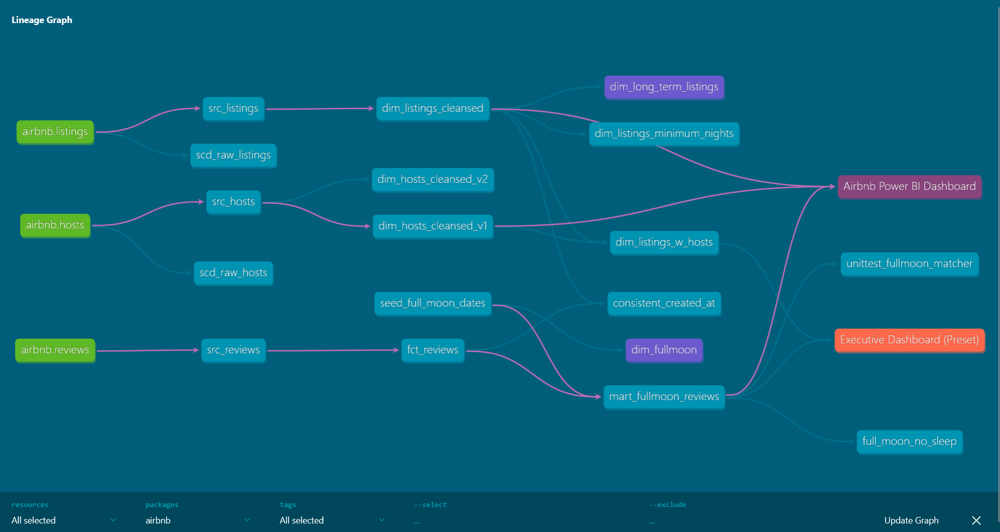
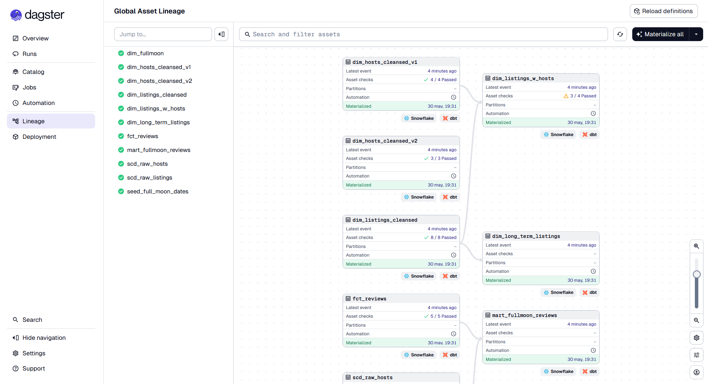
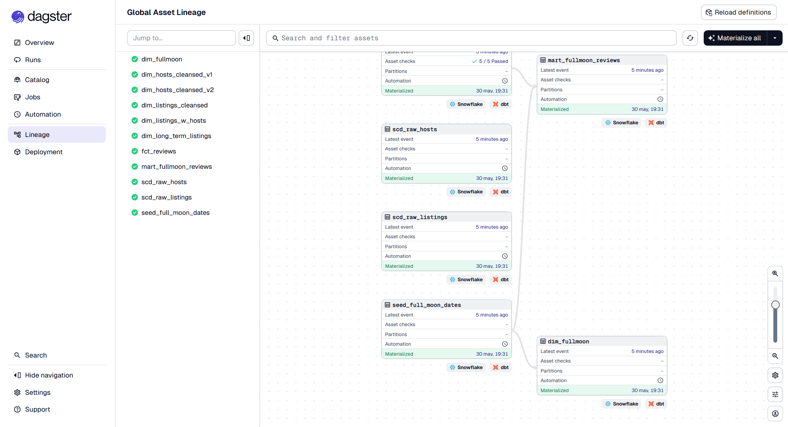

# 🏨 Airbnb Data Project: End-to-End (E2E) Data Pipeline with AWS S3, Snowflake, dbt, Dagster & Power BI / Preset

## 🚀 Project Overview

This repository contains a complete **End-to-End (E2E)** Data Engineering and Data Analytics project that covers the entire data lifecycle. The project transforms raw data into actionable insights by covering Data Ingestion, Data Transformation, Data Modeling, Data Orchestration and Data Visualization, using a modern data stack, and real-world **Airbnb data** (focusing on `listings`, `hosts`, and `reviews`).

The goal of this project is to showcase scalable data modeling, rigorous data quality testing, cloud warehouse management, automated pipeline orchestration, and advanced business intelligence integrations.

## 🏗️ Architecture & Tech Stack

This project follows a modern ELT (Extract, Load, Transform) methodology:

1. **Raw Data Sources (AWS S3):** Real-world datasets hosted on public AWS S3 buckets.
2. **Cloud Data Warehouse (Snowflake):** The robust compute and storage engine.
3. **Data Transformation (dbt Core):** The transformation layer orchestrating data cleansing, SQL modeling, testing and documentation.
4. **Data Visualization (Power BI & Preset):** BI tools connecting securely to the modeled data for interactive analytics.


## ❄️ Snowflake Implementation Details

Snowflake was utilized not just as a storage bucket, but as a scalable data execution engine. Key implementations include:
* **Data Ingestion:** Raw data was loaded into initial Snowflake tables using SQL COPY INTO statements, extracting CSV files directly from public AWS S3 bucket URIs.
* **Environment Separation:** Creation of distinct databases and schemas (e.g., `RAW` for ingestion, `DEV` for dbt development and testing) to ensure a safe development lifecycle.
* **Compute Management:** Configuration of specific **Virtual Warehouses** tailored for different workloads (loading data vs. transforming data).
* **Role-Based Access Control (RBAC):** Setting up specific roles and granting appropriate privileges to ensure secure access for the dbt service user and the BI tools.

## ⚙️ Core dbt Functionalities Implemented

The transformation logic was built entirely using **dbt Core**, acting as the heart of the ELT process. 

* **Modular Data Modeling:** Implementation of a multi-layer architecture:
  * **Sources (Bronze):** Declaring raw Snowflake tables to establish data lineage using the `{{ source() }}` function.
  * **Staging (Silver):** Cleansing raw data, renaming columns for consistency, standardizing data types, and handling null values.
  * **Mart (Gold):** Creating business-ready dimensional models and fact tables optimized for analytics and business intelligence.
* **Materializations:** Strategic use of tables and views to balance compute costs and query performance.
* **Testing & Data Quality:** 
  * Applied built-in generic tests (`unique`, `not_null`, `accepted_values`) on primary keys and critical fields.
  * Developed **custom singular tests** to catch specific business-logic anomalies (e.g., ensuring a listing has valid pricing or minimum nights).
* **Documentation:** Automated `dbt docs` generation, including comprehensive model descriptions and column-level details.
* **Macros:** Developed reusable Jinja SQL logic to handle complex operations across multiple models.
* **Security:** Connection to Snowflake was established via **Key Pair Authentication** (Public/Private keys) for enterprise-grade security.
* **Package Management:** Python dependencies strictly managed using `uv` via the `pyproject.toml` and `uv.lock` files, ensuring a deterministic, reproducible, and fast execution environment.


## 🕸️ Data Lineage Graph (DAG)

The following Directed Acyclic Graph (DAG) generated by dbt Core illustrates the complete data flow. It maps the transformation journey from the raw Snowflake sources (Bronze), through the staging models (Silver), down to the final dimensional marts (Gold) ready for Power BI consumption:




## ⏱️ Data Orchestration with Dagster

To ensure the data pipeline runs reliably and automatically in a production-like environment, **Dagster** was implemented as the orchestration layer, integrating seamlessly with dbt Core.

* **Software-Defined Assets (SDAs):** The dbt project was parsed and loaded into Dagster using the `dagster-dbt` integration. This approach translates every dbt model, seed, and test into individual Python assets, providing highly granular monitoring.
* **Pipeline Scheduling:** Configured automated jobs and schedules to execute the `dbt build` command on a regular cadence, ensuring that downstream Power BI dashboards are consistently fed with fresh and tested data.
* **Observability & UI:** Leveraged the native Dagster UI to visually monitor job executions, track historical run times, analyze the complete asset graph, and easily troubleshoot potential pipeline failures in real-time.






## 📊 Data Visualization & Semantic Modeling

The final layer consists of two distinct dashboards, using different tools, to serve different analytical needs.
While the project explores both **Power BI** and **Preset** for Dashboarding, the advanced semantic modeling and primary reporting are driven by **Power BI**. **Preset** was used to make a cloud-native dashboard for rapid exploration of dbt-transformed models, providing a flexible interface for ad-hoc analysis and quick visual verification.

### Power BI Integration and Data Modeling

* **Secure Authentication:** The connection between Power BI Desktop and Snowflake was established using the native Snowflake connector, via **Key Pair Authentication**. This bypasses basic username/password vulnerabilities.
* **Data Model Design (Snowflake Schema):** Rather than importing flattened, denormalized tables, the Power BI semantic model was deliberately designed using a **Snowflake Schema** to optimize DAX performance, filtering, and relationship management. The hierarchy is structured as follows:
  * `mart_fullmoon_reviews` acts as the central fact table.
  * The `dim_listings_cleansed` dimension table is joined to the `mart_fullmoon_reviews` fact table (1-to-Many relationship).
  * The `dim_hosts_cleansed` dimension table is joined to the `dim_listings_cleansed` dimension table (1-to-Many relationship).


## 🛠️ Technologies & Tools Used

This project leverages a modern data stack to handle everything from raw ingestion to final data visualization:

* **Cloud Storage & Cloud Data Warehouse:** AWS S3, Snowflake
* **Data Transformation & Languages:** dbt Core, SQL, Jinja
* **Data Orchestration:** Dagster
* **Business Intelligence Tools:** Power BI, DAX, Preset
* **Development & Version Control:** VS Code, Python, `uv` (Python package manager), Git


## 📂 Repository Structure

The project is structured to keep dependencies, configurations, and documentation strictly organized:

```text
airbnb-dbt-snowflake/
├── dbt/                     
│   ├── airbnb/              # dbt project folder
│   │   ├── analyses/        # Ad-hoc SQL queries (compiled but not materialized)
│   │   ├── assets/          # Static assets and images for dbt documentation
│   │   ├── models/          # Bronze, Silver(Staging) & Gold (Mart) layers
│   │   ├── macros/          # Custom Jinja SQL logic
│   │   ├── tests/           # Custom singular data quality tests
│   │   ├── seeds/           # Static CSV data for dbt seed materialization
│   │   ├── snapshots/       # Slowly Changing Dimensions (SCD Type 2) historical tracking
│   │   ├── dbt_project.yml  # Main dbt project configuration file
│   │   ├── profiles.yml     # Secured with Environment Variables
│   │   └── selectors.yml    # Custom node selection definitions for targeted dbt runs
│   ├── dagster              # Orchestration folder containing dagster definitions, schedules, and SDAs
│   ├── pyproject.toml       # Python dependencies managed by uv
│   └── uv.lock              # Deterministic dependency lock file
├── aws-s3-data-sources/     # Links for AWS S3 raw datasets
├── docs/                    # Screenshots of Lineage graphs (DAG), dbt docs, dagster serve docs and Snowflake Workspace & Database Explorer
├── dashboards/              # Power BI and Preset Dashboards links and screenshots
├── .gitignore             
└── README.md                # README file
```